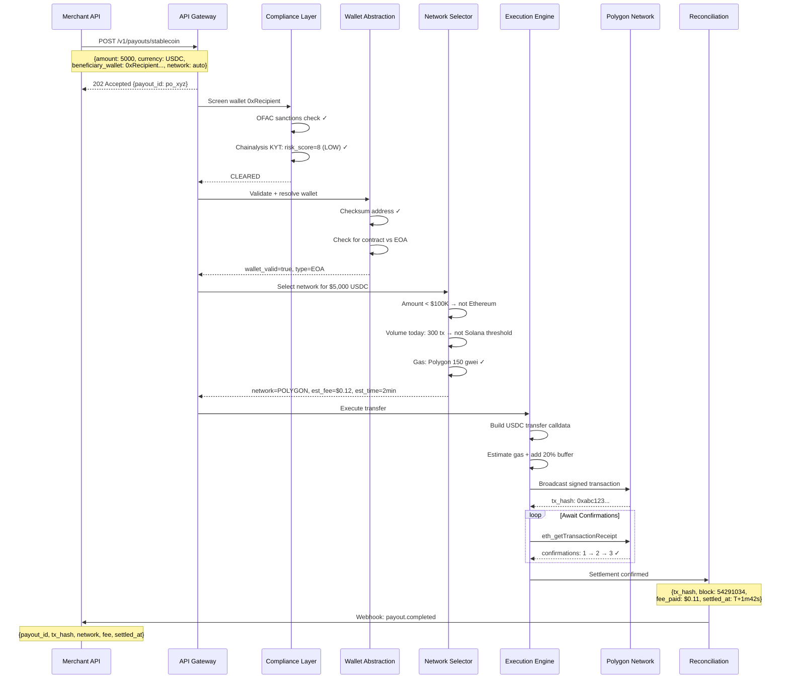
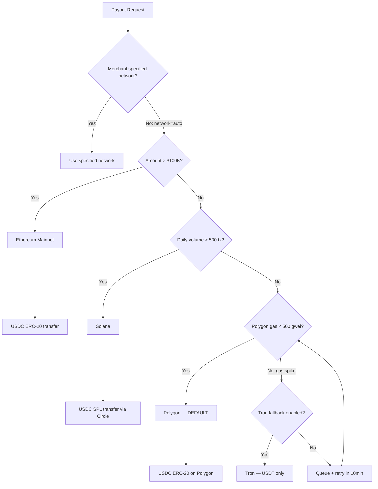
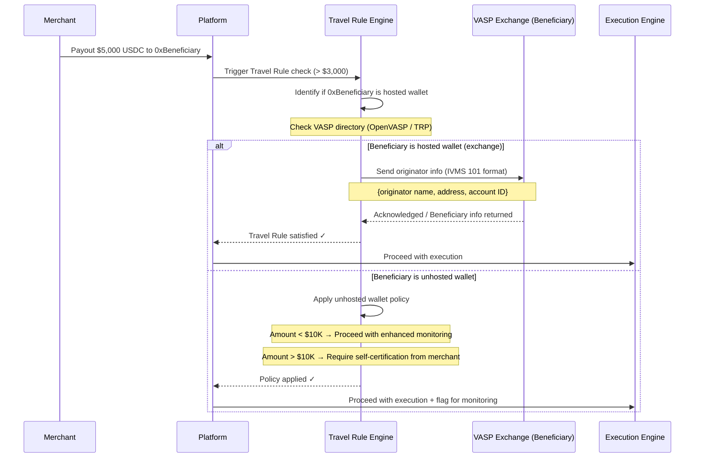
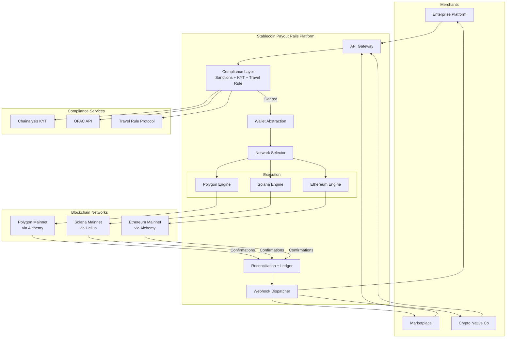
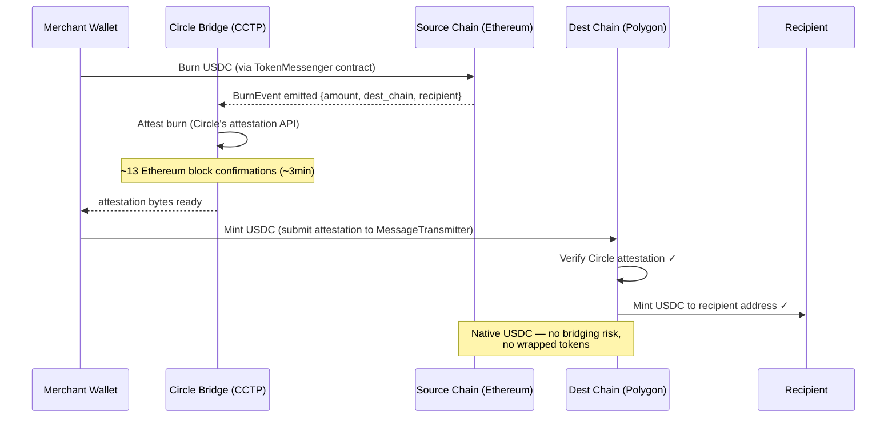

# Stablecoin Payout Rails — Flow Diagrams

All diagrams in [Mermaid](https://mermaid.js.org/) format. Render at [mermaid.live](https://mermaid.live) or in GitHub markdown preview.

---

## 1. End-to-End Payout Flow (Happy Path — Polygon)

---

## 2. Multi-Chain Network Selection

---

## 3. FATF Travel Rule Flow (Transfers > $3,000)

---

## 4. System Architecture — Multi-Chain

---

## 5. USDC Cross-Chain Transfer (Circle CCTP)

