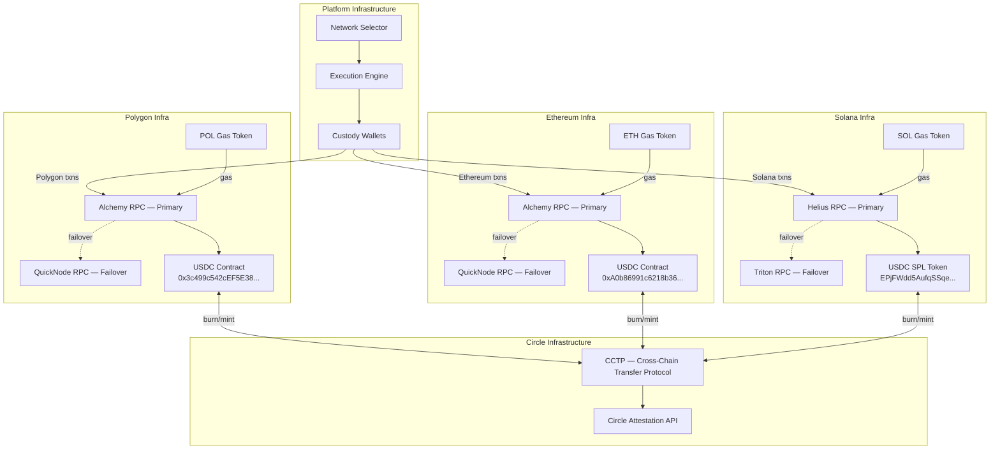

# Multi-Chain Network Topology

## Custody Wallet Architecture

| Network | Wallet Type | Gas Token | USDC Type |
|---|---|---|---|
| Polygon | EVM EOA (HSM-backed) | POL | Native USDC (Circle) |
| Solana | Ed25519 keypair (HSM-backed) | SOL | SPL USDC (Circle) |
| Ethereum | EVM EOA (HSM-backed) | ETH | Native USDC (Circle) |

Each network has a dedicated custody wallet. Wallets are funded with:
- Sufficient stablecoin balance for expected daily payout volume + 20% buffer
- Gas token balance for estimated daily transactions + 50% buffer

Gas token balances are monitored. Alerts fire when balance drops below 48 hours of estimated gas consumption.

## RPC Failover Strategy

Each network uses a primary + failover RPC provider:

1. All requests go to primary provider
2. If primary returns error or times out (>5s), retry on failover
3. If both fail, payout is queued in dead letter with `NETWORK_UNAVAILABLE` status
4. Ops alerted. Payout retried automatically every 10 minutes for 2 hours.
5. After 2 hours, escalated to manual resolution.

## Circle CCTP

Circle's Cross-Chain Transfer Protocol enables native USDC movement between chains without bridging risk:

- **Burn on source chain** → Circle attests the burn → **Mint on destination chain**
- No wrapped tokens. Native USDC on both sides.
- Used when platform needs to rebalance custody wallet USDC across chains
- Not used for individual payouts (each payout executes on a single chain)
