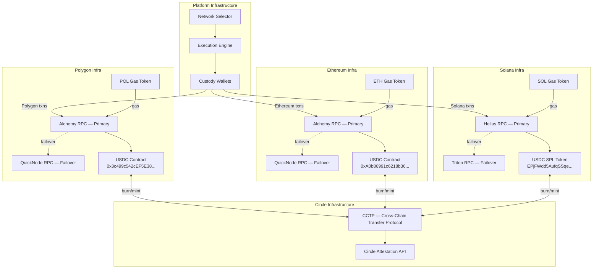

# Multi-Chain Network Topology

## Custody Wallet Architecture

| Network | Wallet Type | Signing Quorum | Gas Token | USDC Type |
|---|---|---|---|---|
| Polygon | EVM (HSM-backed threshold key) | 3-of-5 MPC | POL | Native USDC (Circle) |
| Solana | Ed25519 (HSM-backed threshold key) | 2-of-3 MPC | SOL | SPL USDC (Circle) |
| Ethereum | EVM (HSM-backed threshold key) | 3-of-5 MPC | ETH | Native USDC (Circle) |

Each network has a dedicated custody wallet. Wallets are funded with:
- Sufficient stablecoin balance for expected daily payout volume + 20% buffer
- Gas token balance for estimated daily transactions + 50% buffer

Gas token balances are monitored. Alerts fire when balance drops below 48 hours of estimated gas consumption.

## Custody Signing Model

Custody keys are **never** held as a single EOA secret. Each custody address
is the public image of a threshold signature scheme split across HSMs in
three separate availability zones plus an offline signer.

**Why threshold / MPC instead of a single HSM-backed EOA:**

1. **Key exfiltration is a single point of failure** in a single-HSM model.
   A compromise of one operator account or one HSM firmware bug drains the
   float. Threat model E3 / E4.
2. **Transaction authorization is auditable** per signer. Each share
   contributes a signed approval before the final signature is assembled,
   which means the audit log records which signers authorized which payout.
3. **No single operator can sign a payout.** The 3-of-5 (EVM) and 2-of-3
   (Solana) quorums are chosen so that any insider attack requires
   colluding with at least one other signer — and one signer is an offline
   HSM that only comes online for treasury rebalances.

**Signer roles (EVM, 3-of-5):**

| Signer | Location | Role | Participates in |
|---|---|---|---|
| Signer A | us-east-1 HSM | Hot, automated | Every payout |
| Signer B | us-west-2 HSM | Hot, automated | Every payout |
| Signer C | eu-west-1 HSM | Hot, automated | Every payout |
| Signer D | Offline HSM (Faraday cage) | Cold, manual | Treasury rebalances only |
| Signer E | Break-glass (m-of-n operators) | Cold, manual | Incident recovery only |

Normal payouts are signed by A+B+C. Signer D is required for any
rebalance above the daily auto-rebalance floor. Signer E is only reachable
via the break-glass procedure in `docs/runbook.md` §10.

**Solana (2-of-3):** Hot signers A and B plus an offline signer. The
smaller quorum reflects lower per-transaction value on the Solana rail and
its different recovery model for lost keys.

**Per-request authorization token.** Before any signer contributes a share,
it verifies a short-lived authorization token from the execution engine
signed with a service identity key. This is the control for threat E3 in
the threat model (compromised internal service impersonating the execution
engine). Authorization tokens have a 10-second TTL and are single-use.

**Rotation.** The threshold keys are rotated on a 12-month cadence via a
proactive resharing protocol that generates new shares without ever
reconstructing the underlying private key. See the treasury ops handbook
for the key ceremony checklist.

## RPC Failover Strategy

Each network uses a primary + failover RPC provider:

1. All requests go to primary provider
2. If primary returns error or times out (>5s), retry on failover
3. If both fail, payout is queued in dead letter with `NETWORK_UNAVAILABLE` status
4. Ops alerted. Payout retried automatically every 10 minutes for 2 hours.
5. After 2 hours, escalated to manual resolution.

## Circle CCTP

Circle's Cross-Chain Transfer Protocol enables native USDC movement between chains without bridging risk:

- **Burn on source chain** → Circle attests the burn → **Mint on destination chain**
- No wrapped tokens. Native USDC on both sides.
- Used when platform needs to rebalance custody wallet USDC across chains
- Not used for individual payouts (each payout executes on a single chain)
